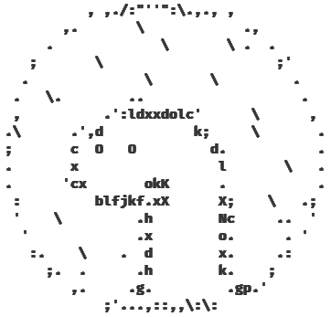

# ⌨️ Tui

[](https://github.com/Im-Beast/deno_tui/actions/workflows/deno.yml)



**Current status:**
[**Release candidate**](https://github.com/Im-Beast/deno_tui/projects/1)

Tui is a simple [Deno](https://github.com/denoland/deno/) module that allows
easy creation of
[Terminal User Interfaces](https://en.wikipedia.org/wiki/Text-based_user_interface).

### Features

- [Decent documentation](https://doc.deno.land/https://deno.land/x/tui/mod.ts)
- [Multiple built-in components](./src/components/)
- [Respects `NO_COLOR` env variable](https://no-color.org/)
- Reactivity
- Simple to use
- Zero dependencies
- Relatively lightweight

## 🎓 Get started

1. Create tui instance

```ts
import {
  compileStyler,
  createTui,
  TuiStyler,
} from "https://deno.land/x/tui@version/mod.ts";

const tui = createTui({
  // Which stdin we read inputs from
  reader: Deno.stdin,
  // To which stdout we render tui
  writer: Deno.stdout,
  // How tui should look
  styler: compileStyler<TuiStyler>({
    foreground: "white",
    background: "black",
  }),
});
```

2. Enable handling keyboard and mouse

```ts
import {
    ...,
    handleKeypresses,
    handleKeyboardControls,
    handleMouseControls
} from "https://deno.land/x/tui@version/mod.ts";

...

// Needed for both keyboard and mouse controls handlers to work
handleKeypresses(tui);
// Enable keyboard controls
handleKeyboardControls(tui);
// Enable mouse controls
handleMouseControls(tui);
```

3. Add some components

```ts
import { ..., createButton } from "https://deno.land/x/tui@version/mod.ts";

...

const componentStyler = compileStyler<TuiStyler>({
  ...tui.styler,
  background: "blue",
  focused: {
    attributes: ["bold"],
    background: "green",
  },
  active: {
    attributes: ["bold", "italic"],
    foreground: "black",
    background: "lightCyan",
  },
});

let counter = 0;
const button = createButton(tui, {
  label: {
    get text() {
      return String(counter);
    },
    align: {
      vertical: "center",
      horizontal: "center",
    },
  },
  rectangle: {
    column: 2,
    row: 1,
    width: 5,
    height: 1,
  },
});

// when button is activated increase counter
button.on("active", () => {
  ++counter;
});
```

4. Render tui

```ts
import { ..., loopDrawing } from "https://deno.land/x/tui@version/mod.ts";

...

loopDrawing(tui);
```

## 🤝 Contributing

I'm open to any idea and criticism. Feel free to add any commits, issues and
pull requests!

## 📝 Licensing

This project is available under **MIT** License conditions.
